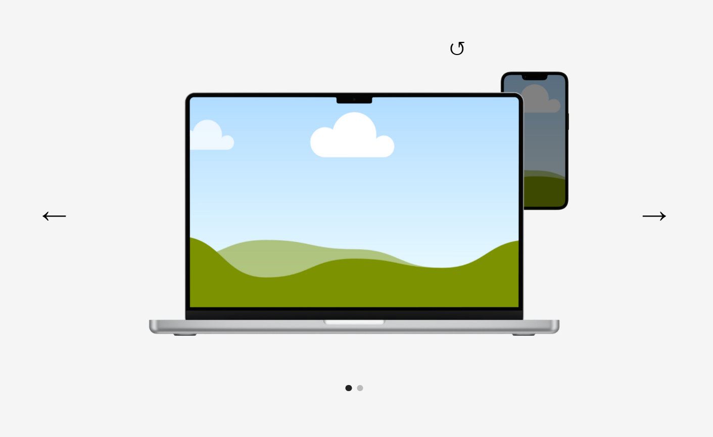

# Simple Layered Slider

This project is a fully custom slider built entirely with **HTML, CSS, and JavaScript**.




## Overview

The main purpose of this slider is to display, within each slide, two different views of a website:
- A **desktop version**
- A **mobile version**

This is achieved through its core feature: **two layers per slide**.

## How It Works

Each slide contains **two overlapping layers**:
- One layer is displayed on top by default
- When the **switch button** is pressed, the layers swap positions

Although this was the original use case (desktop vs mobile preview), the system is flexible and can be used for **any scenario requiring two layers per slide**.

## Features

- Two-layer system per slide
- Smooth switching between layers
- Fully responsive design
- Easy to customize and extend

## Slides

The current implementation includes **two slides**, but you can add **as many slides as needed**.

## Images and Links

- The project uses placeholder images included in the repository
- You can replace them with **any images you want**
- You can also customize the **links associated with each image**

## Elementor Integration

A file is included in the repository containing all the **HTML, CSS, and JavaScript in one place**.

To use it in Elementor:
1. Copy the code
2. Paste it into an **HTML widget**

Additionally, you must add the following custom CSS to the widget:

```css
selector {
  min-height: 500px;
}
```

## Demo

You can try the slider here:  
https://xxosielxx.github.io/simple-layered-slider/

## Real Example

See an implementation example here:  
https://kodyto.com/